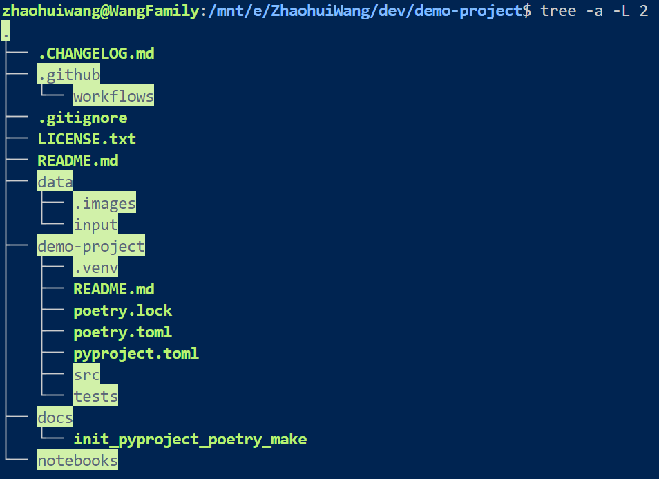

<!-- https://github.com/othneildrew/Best-README-Template -->
<a id="readme-top"></a>
<!--
*** This file was created following the above template
-->


<!-- PROJECT SHIELDS -->
<!--
*** I'm using markdown "reference style" links for readability.
*** Reference links are enclosed in brackets [ ] instead of parentheses ( ).
*** See the bottom of this document for the declaration of the reference variables
*** for contributors-url, forks-url, etc. This is an optional, concise syntax you may use.
*** https://www.markdownguide.org/basic-syntax/#reference-style-links
-->
[![Contributors][contributors-shield]][contributors-url]
[![Forks][forks-shield]][forks-url]
[![Stargazers][stars-shield]][stars-url]
[![Issues][issues-shield]][issues-url]
[![MIT License][license-shield]][license-url]
[![LinkedIn][linkedin-shield]][linkedin-url]


<!-- PROJECT LOGO -->
<br />
<div align="center">
  <h2 align="center">zwtools</h2>
  <p align="center">
    Some awsome tools to jumpstart your projects!
  </p>
</div>

<!-- TABLE OF CONTENTS -->
<details>
  <summary>Table of Contents</summary>
  <ol>
    <li>
      <a href="#about-the-project">About The Project</a>
      <ul>
        <li><a href="#built-with">Built With</a></li>
      </ul>
    </li>
    <li>
      <a href="#getting-started">Getting Started</a>
      <ul>
        <li><a href="#prerequisites">Prerequisites</a></li>
        <li><a href="#installation">Installation</a></li>
      </ul>
    </li>
    <li><a href="#usage">Usage</a></li>
    <li><a href="#roadmap">Roadmap</a></li>
    <li><a href="#contributing">Contributing</a></li>
    <li><a href="#license">License</a></li>
    <li><a href="#contact">Contact</a></li>
    <li><a href="#acknowledgments">Acknowledgments</a></li>
  </ol>
</details>


<!-- ABOUT THE PROJECT -->
### About The Project

I want to document and share some tools I feel valuable ...

Here's why:
* A developer's time should be focused on ...
* A developer shouldn't be doing the same tasks over and over ...
* A developer should implement DRY  (Don't Repeat Yourself) principles to the rest of his/her life :smile:

Of course, all suggestions and contributions are wellcome ...

<p align="right">(<a href="#readme-top">back to top</a>)</p>


### Built With

This section should list any major frameworks/libraries used to bootstrap your project. Leave any add-ons/plugins for the acknowledgements section. Here are a few examples.

* [![Makefile][Makefile.png]][Makefile-url]
* [![GNU Make][Make.png]][Make-url]
* [![Poetry][Poetry.svg]][Poetry-url]

<p align="right">(<a href="#readme-top">back to top</a>)</p>


<!-- GETTING STARTED -->
### Getting Started

This is an example of how you may give instructions on setting up your project locally.
To get a local copy up and running follow these simple example steps.

### Prerequisites

Follow these instructions to install Make on  macOS, Windows, and Linux (WSL Ubuntu).
* macOS, Xcode installs Make automatically, but maybe outdated. Follow the instruction on [Homebrew](https://formulae.brew.sh/formula/make) to install and update the PATH.
  ```sh
  brew install make
  ```
* Window 11
  ```sh
  Set-ExecutionPolicy Bypass -Scope Process -Force; [System.Net.ServicePointManager]::SecurityProtocol = [System.Net.ServicePointManager]::SecurityProtocol -bor 3072; iex ((New-Object System.Net.WebClient).DownloadString('https://community.chocolatey.org/install.ps1'))
  choco install make
  ```
* Linux (WSL Ubuntu)
  ```sh
  sudo apt install make
  ```
Follow the <a href=[Poetrydoc-url]>Installation Guide</a> to install Poetry. I applied both "With pipx" and "With the official installer".
* On Linux, macOS, Windows (WSL) with the official installer
  ```sh
  curl -sSL https://install.python-poetry.org | python3 -
  ```
* On Windows 11 with pipx
  ```sh
  Set-ExecutionPolicy -ExecutionPolicy RemoteSigned -Scope CurrentUser
  Invoke-RestMethod -Uri https://get.scoop.sh | Invoke-Expression
  scoop update
  scoop install pipx
  pipx ensurepath
  scoop update pipx
  pipx install poetry
  ```
* On macOS with pipx
  ```sh
  brew update && brew upgrade pipx
  brew install pipx
  pipx ensurepath
  pipx install poetry
  ```
### Usage

_Below is an example of how you can use the tools to boost your project development._


#### A. `Poetry` module: Use the [`init_pyproject_poetry_make`](https://github.com/zhaohuiwang/zwtools/blob/main/toolbox/init_pyproject_poetry_make) to initiate your python project, the resulting project directory tree is on the left and the repository directory tree (ignoring .venv) on the right.

<p align="center">
  <href="https://github.com/zhaohuiwang/zwtools">
&nbsp; &nbsp; &nbsp; 
  <href="https://github.com/zhaohuiwang/zwtools">
</p>

  1. Copy [`init_pyproject_poetry_make`](https://github.com/zhaohuiwang/zwtools/tree/main/toolbox) to your project directory.
  2. Come up a project repository name, for example "demo-project".
  3. ```sh
     make --file=init_pyproject_poetry_make project-name="demo-project" init-project
     ```
  4. To create a nested shell and activate the virtual environment with `poetry shell`. `deactivate` to deactivate the virtual environment without leaving the shell, and `exit` to deactivate and exit this new shell. Alternatively, to avoid creating a new shell, you can manually activate the virtual environment by running `source $(poetry env info --path)/bin/activate`, `deactivate` to deactivate the venv. See [Poetry: Activating the virtual environment](https://python-poetry.org/docs/basic-usage/) for details. If you are using VS Code, see [Python environments in VS Code](https://code.visualstudio.com/docs/python/environments). To run in an interactive mode, execute `% poetry env info --path` > reveal and copy the path > go to "Select Interpreter" on lower right corner > click the "Enter interpreter path ..." option on the top > paste the path. 
#### <del>B. Python `venv` module: Use the [`init_pyproject_pythonvenv`](https://github.com/zhaohuiwang/zwtools/blob/main/toolbox/init-pyproject-pythonvenv) to initiate your python project (documentation only, not suggested)</del>
<p align="right">(<a href="#readme-top">back to top</a>)


<!-- ROADMAP -->
## Roadmap

- [x] Update README.md
- [x] Add back to top links
- [ ] Add ...
- [ ] Add ...
- [ ] Othere Support
    - [ ] A
    - [ ] B
See the [open issues](https://github.com/zhaohuiwang/zwtools/issues) for a full list of proposed features (and known issues).
<p align="right">(<a href="#readme-top">back to top</a>)</p>


<!-- CONTRIBUTING -->
## Contributing

Contributions are what make the open source community such an amazing place to learn, inspire, and create. Any contributions you make are **greatly appreciated**.

If you have a suggestion that would make this better, please fork the repo and create a pull request. You can also simply open an issue with the tag "enhancement".
Don't forget to give the project a star! Thanks again!

1. Fork the Project
2. Create your Feature Branch (`git checkout -b [...]`)
3. Commit your Changes (`git commit -m 'add ...'`)
4. Push to the Branch (`git push origin [...]`)
5. Open a Pull Request

### Top contributors:

<a href="https://github.com/zhaohuiwang/zwtools/graphs/contributors">
  
</a>

<p align="right">(<a href="#readme-top">back to top</a>)</p>


<!-- LICENSE -->
## License

Distributed under the MIT License. See [`LICENSE.txt`][license-url]for more information.

<p align="right">(<a href="#readme-top">back to top</a>)</p>


<!-- CONTACT -->
## Contact

Name: Zhaohui Wang, Email: `ezhwang` google email

[LinkedIn][linkedin-url]

<p align="right">(<a href="#readme-top">back to top</a>)</p>


<!-- ACKNOWLEDGMENTS -->
## Acknowledgments

Use this space to list resources you find helpful and would like to give credit to. I've included a few of my favorites to kick things off!

* [Choose an Open Source License](https://choosealicense.com)
* [GitHub Emoji Cheat Sheet](https://www.webpagefx.com/tools/emoji-cheat-sheet)
* [Img Shields](https://shields.io)
* [GitHub Pages](https://pages.github.com)
* [Font Awesome](https://fontawesome.com)
* [Best-README-Template](https://github.com/othneildrew/Best-README-Template)
* [Basic writing and formatting syntax](https://docs.github.com/en/get-started/writing-on-github/getting-started-with-writing-and-formatting-on-github/basic-writing-and-formatting-syntax)

<p align="right">(<a href="#readme-top">back to top</a>)</p>


<!-- MARKDOWN LINKS & IMAGES -->
<!-- https://www.markdownguide.org/basic-syntax/#reference-style-links -->
[contributors-shield]: https://img.shields.io/github/contributors/zhaohuiwang/zwtools.svg?style=for-the-badge
[contributors-url]: https://github.com/zhaohuiwang/zwtools/graphs/contributors
[forks-shield]: https://img.shields.io/github/forks/zhaohuiwang/zwtools.svg?style=for-the-badge
[forks-url]: https://github.com/zhaohuiwang/zwtools/network/members
[stars-shield]: https://img.shields.io/github/stars/zhaohuiwang/zwtools.svg?style=for-the-badge
[stars-url]: https://github.com/zhaohuiwang/zwtools/stargazers
[issues-shield]: https://img.shields.io/github/issues/zhaohuiwang/zwtools.svg?style=for-the-badge
[issues-url]: https://github.com/zhaohuiwang/zwtools/issues
[license-shield]: https://img.shields.io/github/license/zhaohuiwang/zwtools.svg?style=for-the-badge
[license-url]: https://github.com/zhaohuiwang/zwtools/blob/master/LICENSE.txt
[linkedin-shield]: https://img.shields.io/badge/-LinkedIn-black.svg?style=for-the-badge&logo=linkedin&colorB=555
[linkedin-url]: https://www.linkedin.com/in/zhaohuiw/
[product-screenshot]: images/screenshot.png
[Makefile.png]: https://img.shields.io/badge/Makefile-0769AD?style=for-the-badge&logo=Makefile&logoColor=white
[Makefile-url]: https://makefiletutorial.com/
[Make.png]: https://img.shields.io/badge/Make-35495E?style=for-the-badge&logo=Make&logoColor=white
[Make-url]: https://www.gnu.org/software/make/
[Poetry.svg]: https://img.shields.io/badge/Poetry-4A4A55?style=for-the-badge&logo=Poetry&logoColor=4FC08D
[Poetry-url]: https://python-poetry.org/
[Poetrydoc-url]: https://python-poetry.org/docs/
